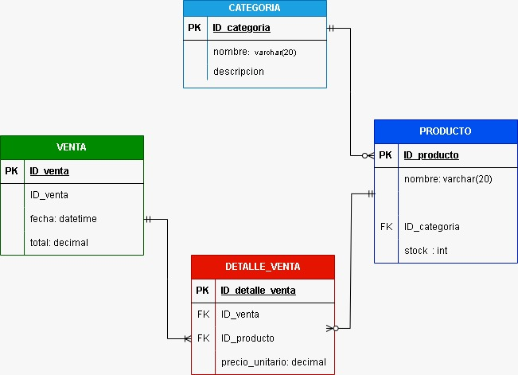

# SISTEMA WEB DE GESTIÓN PARA UNA MINIMARKET
## DESCRIPCIÓN DEL NEGOCIO
### NOMBRE: 
Minimarket "Don Pepe" E.I.R.L.

### CONTEXTO:
Minimarket "Don Pepe" E.I.R.L. es una pequeña empresa peruana dedicada a 
la venta de productos de primera necesidad, como abarrotes,  
bebidas, 
snacks y artículos de limpieza. Está ubicada en la ciudad de Pucallpa, Ucayali, 
y atiende principalmente a familias del sector.  

## IDENTIFICAR EL PROBLEMA Y SOLUCIÓN
## PROBLEMA
El minimarket "Don Pepe" registra todas sus ventas e inventario 
en cuadernos y hojas sueltas, lo que genera pérdida de datos por deterioro 
o extravío de los registros, errores al escribir la información manualmente 
y dificultad para recuperar datos de ventas anteriores cuando el dueño los 
necesita. Esto impide tener un control confiable del negocio. 

## SOLUCIÓN
Se propone desarrollar una aplicación web usando Spring Boot 
(IntelliJ IDEA) como backend para gestionar la lógica del negocio y exponer 
los datos mediante una API REST, con una base de datos MySQL para el 
almacenamiento permanente de la información, y un frontend 
desarrollado con HTML, CSS y JavaScript para la interfaz visual con la que 
interactuará el dueño del negocio. 

## REQUERIMIENTOS FUNCIONALES

| N°           |  ASISTENCIA  |
| ------------ | ------------ |
| RF01 | El sistema debe registrar productos con nombre, categoría, precio unitario y cantidad en stock mediante un formulario web. |
| RF02 | El sistema debe registrar las ventas realizadas indicando los productos vendidos, cantidad y fecha, guardándolos en la base de datos MySQL. | 
| RF03 | El sistema debe actualizar el stock de un producto automáticamente en la base de datos al registrar una venta. |
| RF04 | El sistema debe mostrar el historial de ventas con filtros por fecha y categoría, consumiendo la API REST del backend. |

## REQUERIMIENTOS NO FUNCIONALES 

| N°           |  ASISTENCIA  |
| ------------ | ------------ |
| RNF01 | Rendimiento: La API REST de Spring Boot debe responder las solicitudes del frontend en menos de 3 segundos. |
| RNF02 | Seguridad: El sistema debe validar los datos enviados desde el frontend antes de ser procesados por el backend. 
| RNF03 | Usabilidad: La interfaz desarrollada en HTML, CSS y JavaScript debe ser simple e intuitiva para el dueño del negocio.

## STACK COMPLETO
1. Trello = Gestión del proyecto (Kanban)
2. Draw.io = Diagrama ER + Diagrama de Clases
3. Figma = Wireframe + Diseño UI/UX
4. MySQL Workbench = Diseñar y administrar BD
5. IntelliJ = Frontend (HTML,CSS,JS) + Backend (Spring Boot)
6. XAMPP = Servidor Tomcat para correr la app

## TECNOLOGIAS UTILIZADAS
- Java 17
- Spring Boot 3
- MySQL 8
- HTML5, CSS3, JavaScript
- IntelliJ IDEA
- XAMPP (Tomcat)
- MySQL Workbench
- Figma (diseño UI/UX)
- Draw.io (diagramas)
  
## ESTRUCTURA
Proyecto-Restaurante/
<p>├── backend/          → Spring Boot (Java)</p>
<p>│   ├── src/</p>
<p>│   ├── pom.xml</p>
<p>│   └── ...</p>
<P>├── frontend/         → HTML, CSS, JS</p>
<p>│   ├── css/</p>
<p>│   ├── js/</p>
<p>│   └── index.html</p>

## DIAGRAMA ENTIDAD-RELACIÓN


## DIAGRAMA RELACIONAL

## BASE DE DATOS 
```MySQL
H
```
